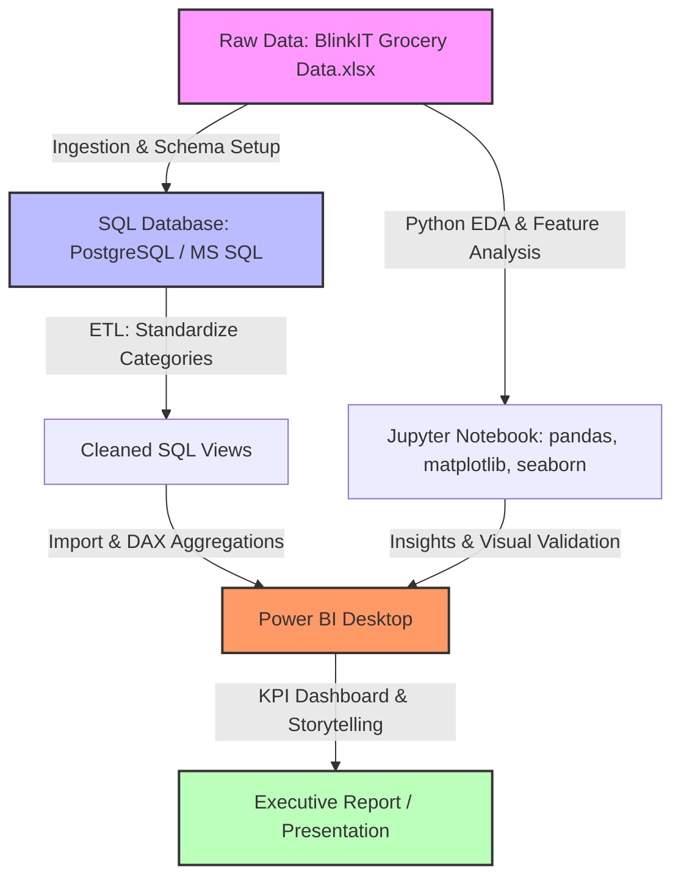

# 🛒 Blinkit Grocery Sales Analytics

Welcome to the **Blinkit Grocery Sales Analytics** repository — an end-to-end data analytics and business intelligence project built to extract, clean, explore, and visualize retail performance across Blinkit's outlet network.

The project stitches together three layers of the analytics stack: **SQL** for database-side ETL and validation, **Python** for exploratory analysis, and **Power BI** for a polished, decision-ready dashboard. Together they trace a full path from a messy transactional export to an executive-facing report.

---

## 📌 Overview & Goals
The core aim of this work is to mine Blinkit's sales records for levers that improve operational efficiency, sharpen inventory decisions, and lift revenue.

The analysis is built around three guiding questions:
* **What drives sales?** — how product-level traits (fat content, item category, etc.) shape revenue.
* **What drives outlet performance?** — how store size, city tier, outlet age, and outlet format influence both sales volume and customer ratings.
* **What drives satisfaction?** — what patterns tie customer ratings to visibility and product category.

---

## 🏗️ Pipeline Overview
The project moves from raw data to a finished dashboard through a repeatable pipeline:



---

## 🧰 Tools & Skills Demonstrated
* **Databases & SQL** — schema design, raw data ingestion, ETL for category standardization, and business-metric calculation using aggregate functions and window functions (`OVER()`).
* **Python for Data Science** — data profiling, missing-value and outlier checks with `pandas`/`numpy`, and distribution analysis with `matplotlib`/`seaborn`.
* **Business Intelligence** — an interactive **Power BI** dashboard built with **DAX** measures, cross-filtering, and multi-page navigation.
* **Data Storytelling** — converting dense tables into visuals a stakeholder can act on immediately.

---

## 📂 Repository Layout
```
📦 Blinkit_Data_Analysis/
├── 📊 BlinkIt.pbix                   # Interactive Power BI dashboard
├── 📄 BlinkIt Dashboard.pdf           # Exported PDF of the dashboard
├── 🐍 Blinkit Analysis.ipynb         # Jupyter notebook for exploratory analysis
├── 🛢️ BlinkIt_SQL.sql                # SQL scripts: schema, cleaning, aggregates
├── 📈 BlinkIT Grocery Data.xlsx       # Raw transactional dataset
├── 📄 Blinkit Insights.pdf            # Written summary of findings
└── 📄 README.md                      # Project documentation
```

---

## 🛢️ SQL Layer: ETL & Aggregation
The full set of database operations lives in [BlinkIt_SQL.sql](file:///e:/Data%20Analytics%20Project/Blinkit_Data_Analysis/BlinkIt_SQL.sql).

### 1. Standardizing Raw Categories
The source data used inconsistent labels for fat content (`LF`, `low fat`, `Low Fat`, `reg`, `Regular`). A cleanup pass normalizes these:
```sql
UPDATE BLINKIT
SET Item_Fat_Content = CASE
    WHEN Item_Fat_Content IN ('LF', 'low fat') THEN 'Low Fat'
    WHEN Item_Fat_Content = 'reg' THEN 'Regular'
    ELSE Item_Fat_Content
END;
```

### 2. Core KPIs
Baseline figures are computed directly in SQL to cross-check downstream dashboards:
* **Total revenue (in millions)**:
    ```sql
    SELECT CAST(SUM(Sales)/1000000 AS DECIMAL(10,2)) AS TOTAL_SALES_MILLIONS FROM BLINKIT;
    ```
* **Average sale value and item count**:
    ```sql
    SELECT CAST(AVG(Sales) AS DECIMAL(10,0)) AS AVERAGE_SALES, COUNT(*) AS NUMBER_OF_ITEMS FROM BLINKIT;
    ```

### 3. Deeper Business Queries
Window-function-driven queries break sales down by store attributes:
* **Sales share by store size**:
    ```sql
    SELECT Outlet_Size,
           CAST(SUM(Sales) AS DECIMAL(10,2)) AS Total_Sales,
           CAST((SUM(Sales) * 100.0 / SUM(SUM(Sales)) OVER()) AS DECIMAL(10,2)) AS Sales_Percentage
    FROM BLINKIT
    GROUP BY Outlet_Size
    ORDER BY Total_Sales DESC;
    ```
* **Outlet-type performance summary**:
    ```sql
    SELECT Outlet_Type,
           CAST(SUM(Sales) AS DECIMAL(10,2)) AS Total_Sales,
           CAST((SUM(Sales) * 100.0 / SUM(SUM(Sales)) OVER()) AS DECIMAL(10,2)) AS Sales_Percentage,
           CAST(AVG(Sales) AS DECIMAL(10,1)) AS Average_Sales,
           COUNT(*) AS Number_Of_Items,
           CAST(AVG(Rating) AS DECIMAL(10,2)) AS Average_Rating
    FROM BLINKIT
    GROUP BY Outlet_Type
    ORDER BY Total_Sales DESC;
    ```

---

## 🐍 Python Layer: Exploratory Analysis
Full analysis notebook: [Blinkit Analysis.ipynb](file:///e:/Data%20Analytics%20Project/Blinkit_Data_Analysis/Blinkit%20Analysis.ipynb). It covers:
1. **Profiling** — auditing null rates in `Item_Weight` and `Outlet_Size`.
2. **Outlier checks** — reviewing the spread of product visibility and sales figures.
3. **Visual exploration** — box plots and correlation heatmaps in `seaborn` to surface relationships ahead of the Power BI build.

---

## 📊 Power BI Layer: Dashboard
Dashboard file: [BlinkIt.pbix](file:///e:/Data%20Analytics%20Project/Blinkit_Data_Analysis/BlinkIt.pbix) (static preview: [BlinkIt Dashboard.pdf](file:///e:/Data%20Analytics%20Project/Blinkit_Data_Analysis/BlinkIt%20Dashboard.pdf)).

### What's on it:
* **Scorecards** — Total Sales, Average Sales, Item Count, and Average Rating at a glance.
* **Fat Content Split** — a donut chart showing `Low Fat` items dominating transaction volume.
* **Category Performance** — a bar chart contrasting top movers (Fruits, Vegetables, Snacking Foods) against slower-selling categories.
* **Outlet Age Trend** — a line chart tracking sales against outlet establishment year (1985–2009).
* **Geographic Breakdown** — sales split across Tier 1, Tier 2, and Tier 3 cities.

> [!NOTE]
> Figures computed in SQL and Python match the Power BI visuals one-for-one, confirming data integrity end to end.

---

## 👨‍💻 About Me

**Aurnav Tyagi**
🎓 **B.Tech, Computer Science & Engineering (Data Science)**
Vellore Institute of Technology (VIT), Chennai

* **Email**: [aurnav1007@gmail.com](mailto:aurnav1007@gmail.com)
* **GitHub**: [github.com/aurnavtyagi](https://github.com/aurnavtyagi)
* **Interests**: Machine Learning, Data Science, Data Engineering,Applied AI,Data Science.

Feel free to reach out or browse my other projects!
